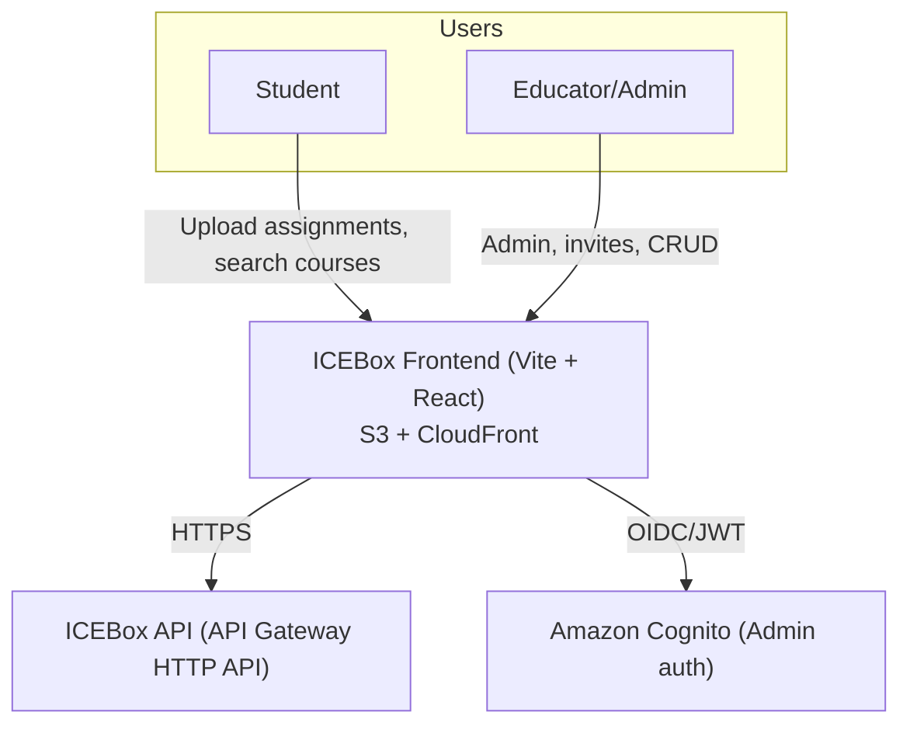
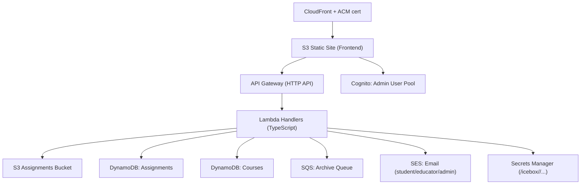
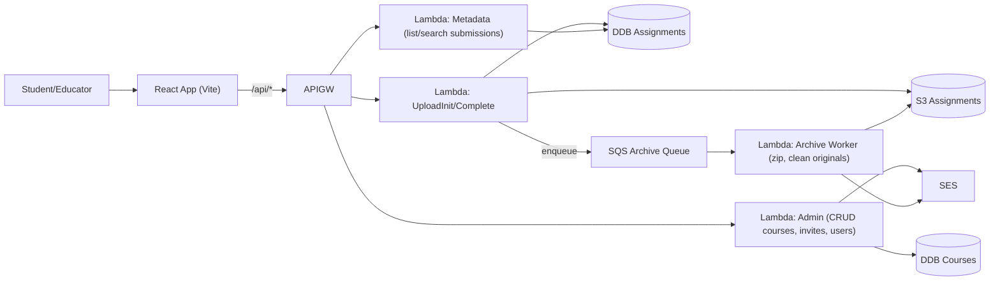
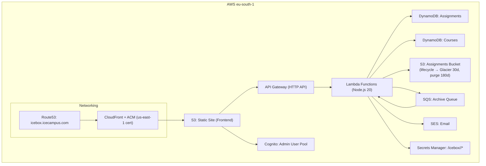
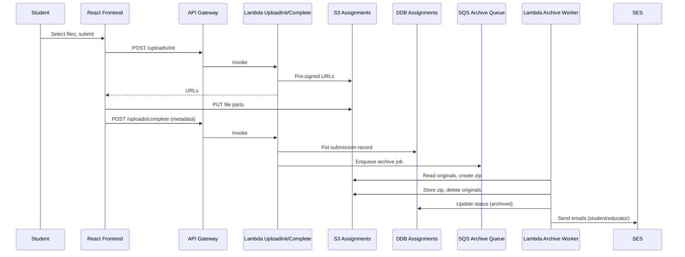

# ICEBox Architecture Overview

This document provides a visual and conceptual overview of the ICEBox system — an AWS-based, serverless platform for managing course submissions, uploads, and administration for ICE Campus.  
It uses the **C4 model** (Context → Containers → Components → Deployment → Sequence) to progressively explain how ICEBox works.

---

## 1. System Context

**Explanation:**  
The System Context diagram shows the main actors (students and educators) and how they interact with the ICEBox frontend, backend API, and authentication layer.

---

## 2. Container Diagram

**Explanation:**  
This view identifies the major application containers — front-end hosting, API gateway, AWS Lambda backend functions, and the key data stores and integrations used to deliver functionality.

---

## 3. Component Diagram

**Explanation:**  
At the component level, the system consists of modular Lambda functions — each responsible for a bounded concern such as uploads, admin actions, metadata, or archival processing.

---

## 4. Deployment Diagram

**Explanation:**  
This diagram illustrates the AWS infrastructure layout — including networking, compute, data, and communication paths across the ICEBox deployment.

---

## 5. Sequence Diagram — Upload Lifecycle

**Explanation:**  
The upload sequence shows the full asynchronous workflow: file upload via pre-signed URLs, metadata registration, background archiving, and notification delivery.

---

## 6. Operations and Deployment Notes

- **Frontend:** built with **Vite + React**, deployed to **S3 + CloudFront**, protected by **Cognito** (admin access only).  
- **Backend:** fully serverless stack built with **Serverless Framework**, using **API Gateway + Lambda + DynamoDB + SQS + SES + Secrets Manager**.  
- **Storage Lifecycle:** uploaded files transition to **Glacier after 30 days** and are **purged after 180 days**.  
- **Deployment Flow:**  
  - Backend: `npm run deploy:<stage>`  
  - Frontend: `npm run build` → upload to S3 → CloudFront invalidation.  
- **Domain:** [https://icebox.icecampus.com](https://icebox.icecampus.com), certificate in **us-east-1**.

---

**Last updated:** October 2025  
Maintainer: *Keith Vassallo*
